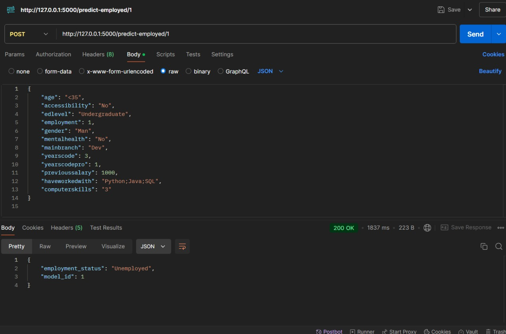
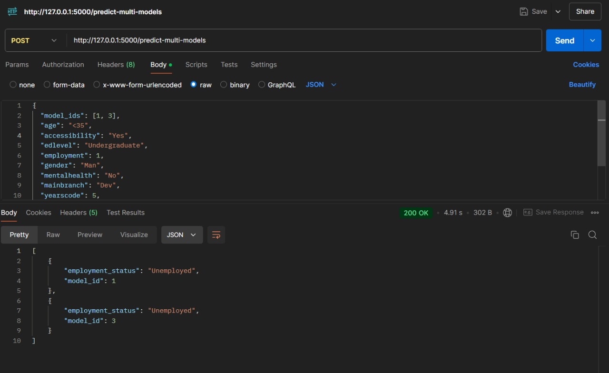
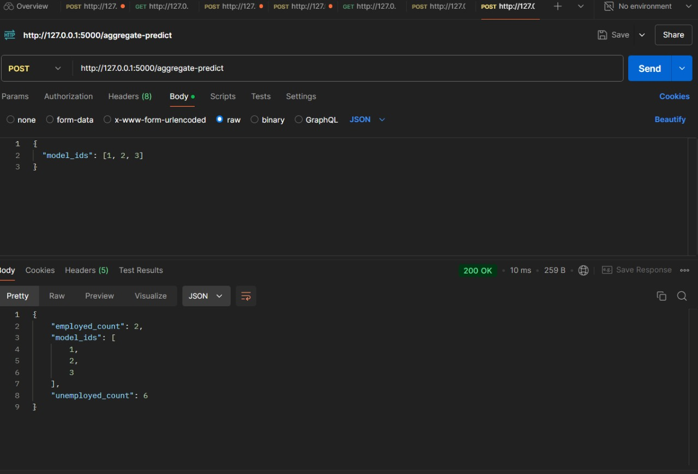
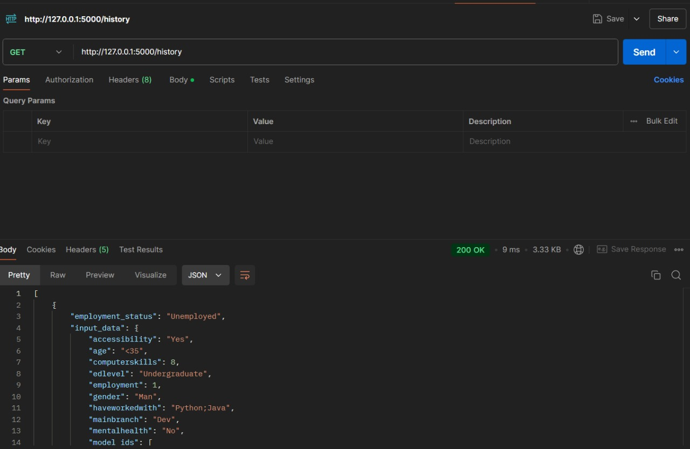

# Project 2 Big Data

## Anggota Kelompok
| Nama                            | NRP        |
| ------------------------------- | ---------- |
| Muhammad Arkananta Radithya Taratugang    | 5027221003 |
| Alma Almira Dewani                        | 5027221054 |
| Sighra Attariq Sumere Jati                | 5027221068 |

## Setup Apache Kafka dan Zookeeper
Instalasi dapat dilakukan dengan menggunakan file `docker-compose.yml` dengan konfigurasi berikut:

```yaml
services:
  zookeeper:
    image: 'bitnami/zookeeper:latest'
    container_name: zookeeper
    environment:
      - ALLOW_ANONYMOUS_LOGIN=yes
    ports:
      - '2181:2181'

  kafka:
    image: 'bitnami/kafka:latest'
    container_name: kafka
    environment:
      - KAFKA_BROKER_ID=1
      - KAFKA_ZOOKEEPER_CONNECT=zookeeper:2181
      - ALLOW_PLAINTEXT_LISTENER=yes
      - KAFKA_LISTENERS=PLAINTEXT://:9092
      - KAFKA_ADVERTISED_LISTENERS=PLAINTEXT://localhost:9092
    ports:
      - '9092:9092'
    depends_on:
      - zookeeper

```

## Cara Mengakses API
Untuk mengirim request dan mengakses respon dari API, gunakan metode berikut

```bash
python3 api/app.py
```

Berikut endpoint API yang dapat diakses:

### Endpoint `/predict-model/<model_id>`
- Endpoint ini digunakan untuk memprediksi status kepegawaian dengan memberi respon dalam dua nilai, yaitu **Employed** ataupun **Unemployed**.

- `model_id` tersedia dari 1-3 (karena ada 3 model yang dilatih)

- Contoh request melalui **Postman**:
    ```bash
    { 
        "age": "<35",
        "accessibility": "Yes",
        "edlevel": "Undergraduate",
        "employment": 1,
        "gender": "Man",
        "mentalhealth": "No",
        "mainbranch": "Dev",
        "yearscode": 5,
        "yearscodepro": 3,
        "previoussalary": 60000,
        "haveworkedwith": "Python;Java",
        "computerskills": 8
	}
    ```

- Contoh response dari API
    ```json
        "employment_status": "Unemployed",
        "model_id": 1
    ```

- Dokumentasi API


### Endpoint `/predict-multi-models`
- Endpoint ini digunakan untuk memprediksi status kepegawaian menggunakan beberapa model secara bersamaan.

- `model_id` tersedia dari 1-3 (karena ada 3 model yang dilatih) dengan pilihan untuk menggunakan seluruh model bersamaan ataupun hanya satu atau dua model bergantian.

- Contoh request melalui **Postman**:
    ```bash
    { 
        "model_ids": [1, 3], 
        "age": "<35",
        "accessibility": "Yes",
        "edlevel": "Undergraduate",
        "employment": 1,
        "gender": "Man",
        "mentalhealth": "No",
        "mainbranch": "Dev",
        "yearscode": 5,
        "yearscodepro": 3,
        "previoussalary": 60000,
        "haveworkedwith": "Python;Java",
        "computerskills": 8
	}
    ```

- Contoh response dari API
    ```json
    {
        "employment_status": "Unemployed",
        "model_id": 1
    },
    {
        "employment_status": "Unemployed",
        "model_id": 1
    }
    ```

- Dokumentasi API


### Endpoint `/aggregate-predict`
- Endpoint ini digunakan untuk menghitung jumlah dari **Employed** ataupun **Unemployed** berdasarkan jumlah model dan percobaan yang telah dijalankan.

- `model_id` tersedia dari 1-3 (karena ada 3 model yang dilatih) untuk merekapitulasi hasil prediksi dari seluruh model.

- Contoh request melalui **Postman**:
    ```bash
    { 
        "model_ids": [1, 2, 3]
	}
    ```

- Contoh response dari API
    ```json
    {
        "employment_count": 2,
        "model_ids": [
            1,
            2,
            3
        ],
        "unemployed_count": 6
    }
    ```

- Dokumentasi API


### Endpoint `/history`
- Endpoint ini digunakan untuk mengambil **(GET)** hasil dari seluruh prediksi yang telah dijalankan beserta model yang digunakan untuk memprediksi.


- Contoh response dari API
    ```json
    { 
        "employment_status": "Unemployed",
        "input_data": {
            "age": "<35",
            "accessibility": "Yes",
            "edlevel": "Undergraduate",
            "employment": 1,
            "gender": "Man",
            "mentalhealth": "No",
            "mainbranch": "Dev",
            "yearscode": 5,
            "yearscodepro": 3,
            "previoussalary": 60000,
            "haveworkedwith": "Python;Java",
            "computerskills": 8
            "model_ids": {
                1
            }
        }
	}
    ```

- Dokumentasi API
